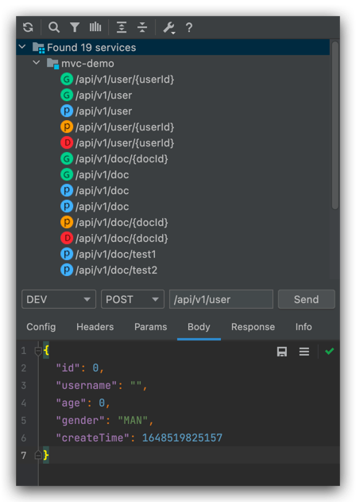
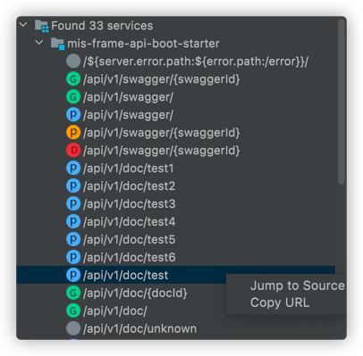
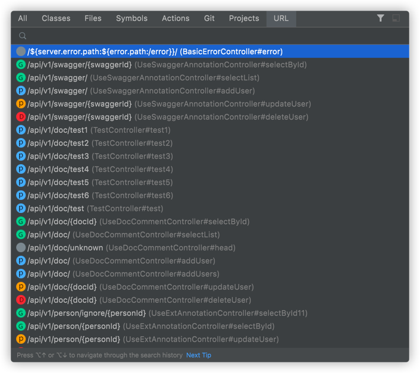
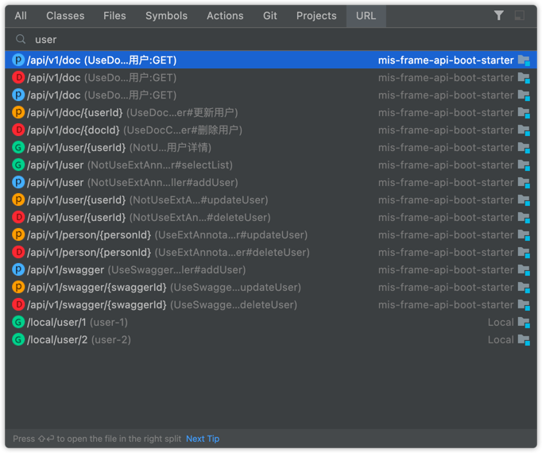
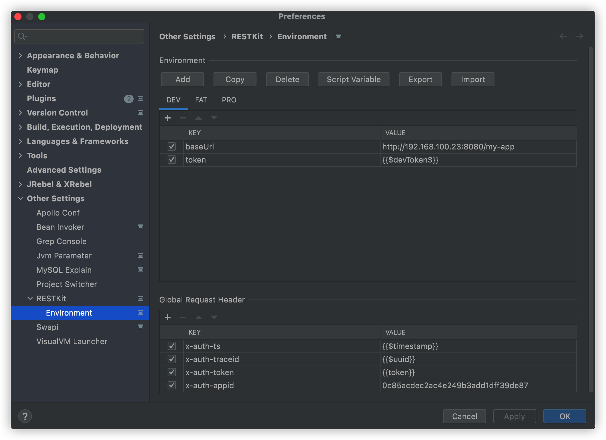
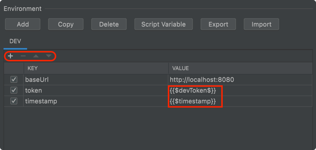
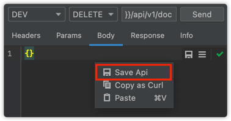
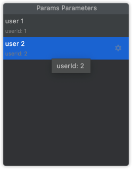
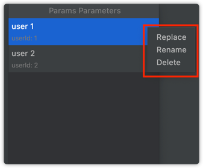
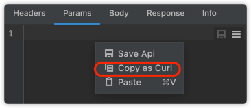

<a href="https://plugins.jetbrains.com/plugin/14723-restkit"></a>

## 一套功能强大的 Restful 服务开发辅助工具集


[英文](./README.md) | [Gitee](https://gitee.com/newhoo/RESTKit) | [语雀](https://www.yuque.com/newhoo/restkit)

本插件致力于提升开发效率之作，只有实用常用的功能。源于最初版本的RestfulToolkit，同时加入Postman的常用功能，丰富且完善的功能能极大地提高Idea开发的效率。免费分享给大家使用，不用于商业用途。如有使用问题，请反馈于我。

如果你觉得本插件不错，请赏个好评吧，同时也欢迎提供宝贵的建议。🌟 Star | [Ratings](https://plugins.jetbrains.com/plugin/14723-restkit/reviews)

## 特性
- 支持更多的jetbrains产品，不仅仅是idea
- Restful服务自动扫描与展示
    - 原生Search Everywhere支持restful URL搜索 ( <kbd>Ctrl \\</kbd> or <kbd>Ctrl Alt N</kbd> )
    - 窗口显示 Services tree
    - URL和Method相互跳转
- 强大好用的请求工具：
    - 自定义参数格式，支持占位符变量，JSON自动格式化
    - 环境变量：支持变量使用、管理及迁移，提供内置函数和脚本函数
    - 全局请求头：支持和环境变量一起使用，提供内置函数和脚本函数
    - 参数库：支持Headers、Params、Body参数展示、保存和删除
    - 多协议：默认支持http，可扩展支持dubbo、grpc等
    - 请求脚本：支持前置/后置请求脚本
    - 请求响应的信息（HTTP报文）展示
- 日志保存：支持保存多协议服务的请求日志，比如HTTP报文格式；
- 插件扩展：用户可实现其他框架和协议的接口扫描及请求发送客户端；
- 语言和框架：
  - 默认支持本地API存储
  - idea默认支持 Spring 体系 (Spring MVC / Spring Boot with Java or Kotlin)

## 生态
- Local Store：默认支持，支持存储API到本地文件
- Spring MVC：默认支持，支持Java and Kotlin实现
- Jax-Rs：通过插件支持，见 [RESTKit-JAX-RS](https://github.com/newhoo/RESTKit-JAX-RS)
- Dubbo：通过插件支持，见 [RESTKit-Dubbo](https://github.com/newhoo/RESTKit-Dubbo) ，支持扫描和请求发送
- Redis：通过插件支持，见 [RESTKit-Redis](https://github.com/newhoo/RESTKit-Redis) ，支持存储API到redis和简单的redis命令发送
- grpc：todo，计划通过插件支持


## 安装
- **插件市场安装**

推荐 <kbd>Preferences(Settings)</kbd> > <kbd>Plugins</kbd> > <kbd>Browse repositories...</kbd> > <kbd>输入"RESTKit"</kbd> > <kbd>点击Install</kbd>

- **本地安装**

从仓库下载<kbd>distributions/RESTKit-x.x.x.zip</kbd>, 然后在本地Idea安装 <kbd>Preferences(Settings)</kbd> > <kbd>Plugins</kbd> > <kbd>Install Plugin from Disk...</kbd>

由于idea兼容性问题，强烈建议从插件市场选择合适的版本下载进行安装。

## 使用

### RESTKit Tool window
打开项目，找到窗口右边的RESTKit，打开。窗口主要由 **Toolbar**、**service tree**、**request client** 构成。以下分别介绍：



#### Toolbar
- 刷新：如果没有找到更新的api，点击刷新图标
- 搜索：打开search everywhere搜索service url
- 过滤：按照http method过滤
- 扫描依赖：选中时可搜索依赖包中的restful services
- 设置：可打开插件配置和环境变量配置


#### service tree
- 按模块展示项目中搜索到的restful services，支持idea自身的输入搜索
- 在URL上双击，可跳转到源码的Method
- 在URL上右键，展示右键菜单



#### request client
- 环境变量：下拉选择已添加的环境变量组，不存在时会跳转到环境变量配置页面。鼠标Hover时可预览当前环境变量
- Method：http method，一般不需要手动选择
- URL：http请求的uri，一般不需要手动输入。支持占位符。
- Send：点击发送一次请求
- Config: 请求的配置，由发送请求的client提供，如http请求会生成baseUrl和timeout。第一条固定为 `protocol: 具体协议`。一般不要删除该文本下的键值对。
- Headers tab: 请求头参数，一般不需要手动输入。支持占位符和参数库操作。
- Params tab: 包括uri路径参数、查询参数和form参数，一般不需要手动输入。支持占位符和参数库操作。
- Body tab: POST/PUT/PATCH/DELETE对应的body参数，一般不需要手动输入。
- Response tab: 展示请求返回的结果。内容可能是正常返回、异常返回、后置请求脚本返回结果。
- Info tab: 展示请求信息。


### 搜索URL
- search everywhere: <kbd>Double Shift</kbd> or click **search icon**。
  - 在search everywhere中选中具体的URL后，按<kbd>Option</kbd>或<kbd>Alt</kbd>，可跳转到service tree中对应的URL。
  - 在设置中设置是否展示module名称。
- service tree：支持idea自身的输入搜索





### 通用设置
提供插件全局的一些配置


#### 操作路径：
- <kbd>Preferences(Settings)</kbd> > <kbd>Other Settings</kbd> > <kbd>RESTKit</kbd>
- <kbd>RESTKit tool window</kbd> > <kbd>toolbar</kbd> > <kbd>setting</kbd> > <kbd>Common Setting</kbd>

#### 支持的框架
目前支持类型包括扫描类型和存储类型。扫描类型支持由源码解析得到，不支持增加/更新/删除等操作。存储类型用于自定义API的增删改查，需自行提供存储方式，如文件存储、redis存储等。

对于所有的jetbrains ide，默认提供Local Store，通过本地文件方式存储API。路径设置参考下文的其他配置。
对于idea，默认支持Spring MVC，包括Java和kotlin的实现。

勾选即启用，若需要支持其他框架的restful接口，请参考：[插件扩展](#插件扩展)

#### UI配置
- 在search everywhere中展示URL的module名称
- 使用接口所在文件名作为分组名，默认使用模块名
- 使用接口描述作为接口名称，默认使用URI
- 启用参数库：默认启用。设置后需重新打开当前项目

#### 请求配置
- http请求超时：设置请求超时时长，设置时长小于等于0时不超时
- 启用保存请求日志：默认不启用，保存路径为 `$PROJECT_DIR$/.idea/restkit/logs/*.log`
- 请求脚本：设置前置/后置请求脚本路径。当输入框为空时，可双击`Label`自动生成脚本，默认生成路径为：`$PROJECT_DIR$/.idea/restkit/xxx-request Script.js`


#### 其他配置
- 本地API存储路径：鼠标左键双击生成项目下的路径，右键双击生成用户目录下的路径。

### 环境变量
- 环境变量表示提前配置的一组或多组变量，包括`字面量变量`、`直接引用变量`、`内置函数变量`和`脚本变量`。
- 可用于URL、Config、Headers、Params和请求脚本等。
- 通过占位符方式来引用环境变量。
- 每个项目的配置独立（Project级别），支持导入导出。



#### 设置
- <kbd>Preferences(Settings)</kbd> > <kbd>Other Settings</kbd> > <kbd>RESTKit</kbd> > <kbd>Environment</kbd>
- <kbd>RESTKit tool window</kbd> > <kbd>toolbar</kbd> > <kbd>setting</kbd> > <kbd>Environment Setting</kbd>

#### 添加
1. 点击<kbd>Add</kbd>，输入唯一的环境变量组名。建议使用简短名称，比如`DEV`、`FAT`、`UAT`、`PRE`、`PRO`。
2. 在当前组下的列表中增加/删除/移动变量键值对，可勾选是否启用。
3. 默认会创建`baseUrl: http://localhost:8080`，适用于HTTP协议接口，用于替换Config Tab中的`{{baseUrl}}`。
4. **VALUE**为字符串，可使用内置函数变量和脚本变量，参见下文说明。



#### 复制
从当前环境变量复制一份新的环境变量。点击<kbd>Copy</kbd>，输入唯一的环境变量组名，命名不能重复。

#### 删除
删除当前环境变量组及内容，点击<kbd>Delete</kbd>。

#### 导出&导入
1. 点击<kbd>Export</kbd>将本页配置中的环境变量、环境脚本、全局请求头以JSON格式复制到剪切板。
2. 在需要导入环境变量的项目中打开配置页面，点击<kbd>Import</kbd>。导入的环境变量会替换当前已配置的所有内容。
3. 若导出导入过程中出现异常，请参考`Event Log`中的提示。

#### KEY-VALUE规则
KEY、VALUE均为字符串，其中VALUE支持引用变量，支持如下：
- 直接引用变量：引用当前环境变量中已存在的键值对，使用方式：`{{KEY}}`
- 内置函数变量：默认提供了内置函数，使用方式：`{{$functionName}}`
  - `{{$timestamp}}` 当前时间戳，ms
  - `{{$uuid}}` 生成UUID
- 脚本变量：点击<kbd>Script Variable</kbd>，在弹出框中编辑脚本变量。目前只支持Java语言，编写规则参考注释，无第三方库支持。使用方式：`{{$methodName$}}`

```java
public class RestKitScript {

    /**
     * Your script method, no param, method name must from {{$methodName$}}.
     * Use pre-request script can be more powerful.
     *
     * @return return value should be String
     */
    public static String methodName() {
        return "";
    }

}
```

#### 全局请求头
配置当前项目中发送请求时默认附带的请求头。


### 本地API库
- 本地API库适用于手动保存API，独立于源码扫描出的接口，在service tree中默认展示为自定义分组。
- 根据url和method组合值作为唯一性判断
- 默认启用，可在设置中关闭
- 支持跨IDE/项目同步（不同IDE/项目时可设置为本地同一文件）

#### 展示


#### 添加/更新
在Request Client的任意编辑器区域右键，点击【Save Api】。已存在api时会提示。




- Protocol: 支持的协议，默认提供http。可扩展，如dubbo
- Storage: 存储API的方式（目的地）。可扩展
- Group: 分组名
- Description: 描述，建议简短明了
- Existed: 是否已存在，根据method+url一起判断

#### 删除
在列表api上右键，删除


#### 导入/导出
- 导出: 可导出所有/按模块/多选/单个，分别对应不同树节点右键菜单
- 导入: 在树根结点右键菜单导入


### 参数库
- 参数库是用于保存请求参数的仓库，支持保存Headers、Params和Body等参数。
- 参数库存在多个，**每个参数库和URL、method 唯一绑定**。
- 在对应编辑器右上角有两个图标<kbd>Save</kbd>和<kbd>List</kbd>，分别对应 **保存** 和 **选择** 参数，其中 **选择** 参数的图标会同时展示当前保存过的数量。


#### 保存参数
保存当前编辑好的参数，以便留给将来使用。点击<kbd>Save</kbd>图标，输入唯一的名称。


#### 使用参数
点击<kbd>List</kbd>图标，可以看到当前URL和method绑定的参数库。

- 鼠标Hover时会预览当前选择的参数
- 单击鼠标左键，当前选择参数会替换对应编辑器的内容



#### 管理参数
在参数列表中，每一行对应一个<kbd>Setting</kbd>图标，点击可对该参数重命名和删除。
- Replace: 使用当前编辑器中的内容来替换选中项
- Rename
- Delete



#### 清空所有参数
在当前项目中找到文件 `$PROJECT_DIR$/.idea/restkit/RESTKit_ParameterLibrary.xml`，删除即可。


### 请求脚本
在发送请求前后，可通过脚本对请求的前后内容进行操作，方便使用，如可以替换token、加密请求等。

> Note  
> 该功能使用了Java Nashorn脚本引擎实现，该引擎计划在JDK11后移除，暂无替换实现。

#### 设置脚本路径
参考本文 `通用设置` > `请求脚本`


#### 前置脚本

- 默认生成的前置脚本位于：`$PROJECT_DIR$/.idea/restkit/Pre-request Script.js`

- 使用说明：
```js
// You can use custom preset object request and environment, attributes are:
//
// request attributes
// url:         java.lang.String,               request url, can be modified by pre-request script.
// method:      java.lang.String,               request method, can be modified by pre-request script.
// config:      java.util.Map<String, String>,  request config, can be modified by pre-request script.
// headers:     java.util.Map<String, String>,  request headers, can be modified by pre-request script.
// params:      java.util.Map<String, String>,  request params, can be modified by pre-request script.
// body:        java.lang.String,               request body, can be modified by pre-request script.
//
// environment: java.util.Map<String, String>,  current environment, defined in the Environment setting, readonly.
//
// See more usages in nashorn-users-guide: https://docs.oracle.com/en/java/javase/12/nashorn/nashorn-users-guide.pdf
```

- 示例：
```js
var env = environment;
var baseUrl = env.baseUrl;
var username = env['username'];

var req = request;
var url = req.url;
var method = req.method;
var headers = req.headers;
var params = req.params;
var body = req.body;

req.url = 'http://httpbin.org/ip';
req.method = 'GET';
req.headers = {
    'x-auth-ts': '' + new Date().valueOf(),
    'x-auth-traceid': '83b557cc-366a-4274-8912-078e71216c51',
};
req.headers['x-auth-token'] = '70309f2cc6a6462497f824e77baa77f9';
req.params = { code: 'ABCD' };
req.params.name = 'JavaNashorn';
req.body = JSON.stringify({ reqBody: 'Hello world!' });
```

#### 后置脚本
- 默认生成的后置脚本位于：`$PROJECT_DIR$/.idea/restkit/Post-request Script.js`

- 使用说明：
```js
// You can use custom preset object request、response and environment, attributes are:
//
// request: see pre-request script comment
//
// response attributes
// original:    org.apache.http.HttpResponse,   original http response, from http-client 4.4.
// body:        java.lang.String,               response body can be modified by post-request script.
//
// environment: java.util.Map<String, String>,  current environment, defined in the Environment setting, readonly.
//
// See more usages in nashorn-users-guide: https://docs.oracle.com/en/java/javase/12/nashorn/nashorn-users-guide.pdf
```

- 示例：
```js
var env = environment;
var baseUrl = env.baseUrl;
var username = env['username'];

var req = request;
var resp = response;
var statusCode = resp.original.getStatusLine().getStatusCode();

if (statusCode != 200) {
    resp.body = JSON.stringify({ error: 'error occurred!' });
} else {
    resp.body = JSON.parse(resp.body).origin;
}
```

#### 请求执行过程


### 插件扩展
RESTKit从`2.0.1`版本开始提供了扩展点:
- `io.github.newhoo.restkit.restful.ep.RestfulResolverProvider` 自定义扫描restful接口。
- `io.github.newhoo.restkit.restful.ep.LanguageResolverProvider` 自定义语言相关的操作，具体参考源码说明。
- `io.github.newhoo.restkit.restful.ep.RestClientProvider` 自定义请求协议，从`2.0.3`开始支持。

使用示例：

- plugin.xml
```xml
<idea-plugin>
    ...
    <depends>io.github.newhoo.restkit</depends>

    <extensions defaultExtensionNs="io.github.newhoo.restkit">
        <!-- your restful resolver implementation -->
        <restfulResolver implementation="io.github.newhoo.restkit.feature.javaimpl.spring.SpringRequestResolver$SpringRequestResolverProvider"/>
        <languageResolver implementation="io.github.newhoo.restkit.feature.javaimpl.language.JavaLanguageResolver$JavaLanguageResolverProvider"/>
        
        <restfulResolver implementation="io.github.newhoo.restkit.ext.jaxrs.JaxrsResolverProvider"/>
    </extensions>
</idea-plugin>
```

- RestfulResolverProvider instance
```java
public class JaxrsResolverProvider implements RestfulResolverProvider {

    @Override
    public RequestResolver createRequestResolver(@NotNull Project project) {
        return project.getComponent(JaxrsResolver.class);
    }
}
```

- LanguageResolverProvider instance
```java
public class JavaLanguageResolver implements LanguageResolver {

  @NotNull
  @Override
  public Language getLanguage() {
    return JavaLanguage.INSTANCE;
  }
  
  ...

  public static class JavaLanguageResolverProvider implements LanguageResolverProvider {

    @NotNull
    @Override
    public LanguageResolver createLanguageResolver(@NotNull Project project) {
      return new JavaLanguageResolver();
    }
  }
}
```

完整示例请参阅：源码和[RESTKit-Dubbo](https://github.com/newhoo/RESTKit-Dubbo)


### 其他使用

#### Microservice Feature
Url navigate to service tree.


#### Java Method跳转到service tree
在方法名称上右键，在弹出的上下文菜单中选择 `Jump to restful service tree`

#### Java类生成JSON
在需要生成的Java类名称上右键，在弹出的上下文菜单中选择 `Convert to JSON`


#### 复制为curl
在http client任意编辑区右键菜单中点击【Copy as Curl】



#### 快捷工具
路径：<kbd>Tools</kbd> > <kbd>RESTKit</kbd>


## 联系 & 反馈
[Issues](https://github.com/newhoo/RESTKit/issues) | [Email](mailto:huzunrong@foxmail.com) | [Ratings & Previews](https://plugins.jetbrains.com/plugin/14723-restkit/reviews)

> 注意  
> 反馈时请务必附上必要信息：Idea版本、插件版本、异常内容、复现方式(如果有)、诉求等。


## 支持作者
如果觉得本插件不错，提升了你的开发效率，那么请作者喝杯咖啡吧～你的支持是鼓励我前行的动力，非常感谢。

