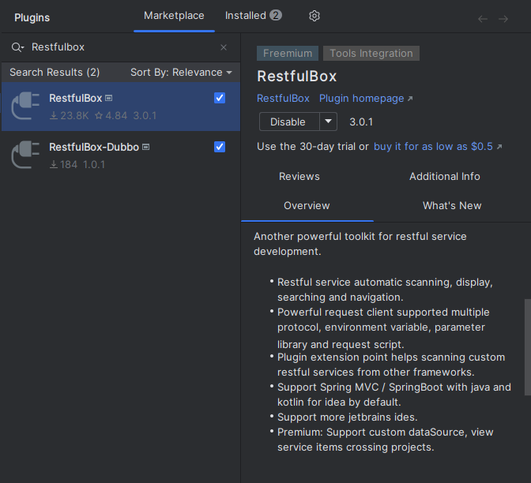
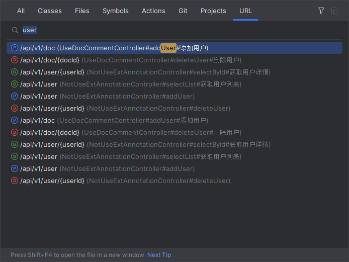
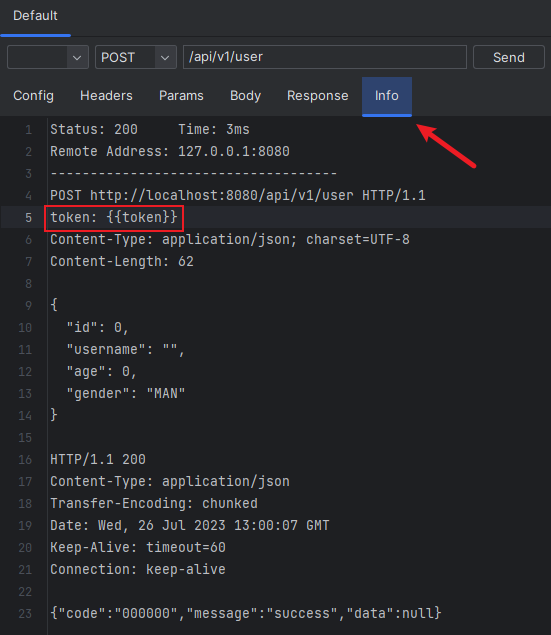
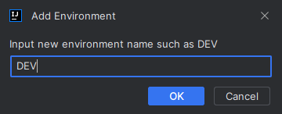
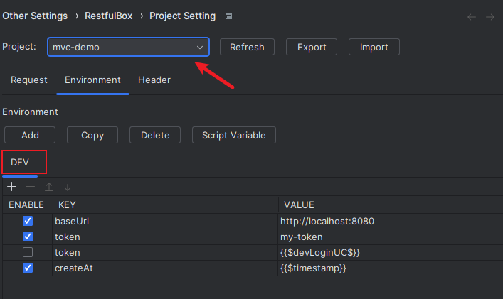
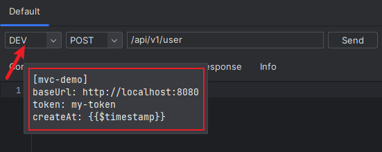
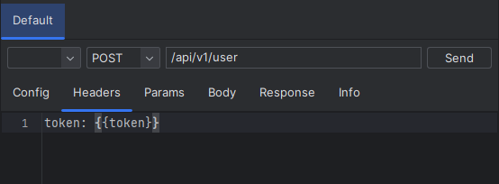
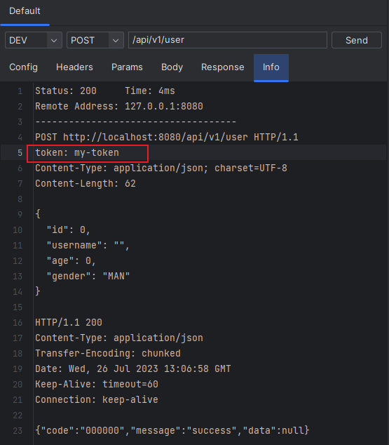

# 快速开始

## 安装插件
在jetbrains IDE插件仓库中搜索 **RestfulBox**，搜索RESTKit为旧版本，安装插件。

安装后重启IDE

## 浏览API

对于IDEA用户：打开springmvc/springboot项目，找到界面右侧 `RestfulBox` 窗口。点击顶部工具栏刷新，可看到当前项目中的restful接口列表。

对于其他IDE用户：可手动[保存API](../核心功能/管理API.md#添加和更新)后再刷新；*或者添加相关的扩展插件*。

点击顶部搜索按钮，或者快捷键`Ctrl \`，可在Search Everywhere中搜索API并跳转

## 发送请求

点击列表中的一项，会自动生成请求所需的参数。

点击发送请求，查看响应结果

查看完整的请求响应内容

至此完成了基本使用。

## 使用环境变量

开发过程中，一般会区分不同的环境，比如开发环境、测试环境、线上环境等。为了方便调用不同环境的接口，可以创建环境变量。第一次使用时，当前项目中不存在环境变量，可自行添加。

找到环境变量设置，点`Add`添加新的环境，如**DEV**

在**DEV**环境下添加变量：

保存后，在发送请求前选择DEV环境，hover查看详情。

在上面的请求中，请求头`token: {{token}}`是一个占位符形式，`{{token}}`表明引用了环境变量token。

看到再次发送请求，可以看到请求到了DEV环境。相应的变量也进行了替换。

更多的环境变量介绍请参考：[环境变量](../核心功能/环境变量.md)。

## 保存API

在请求客户端下任意的Tab中右键，选择【Save Api】

进行简单的参数编写后点击`OK`进行保存。刷新列表后就可以看到保存的API。

## 更多介绍请浏览文档其他部分
