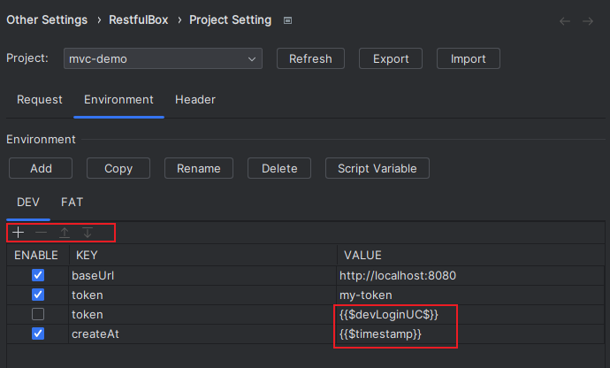
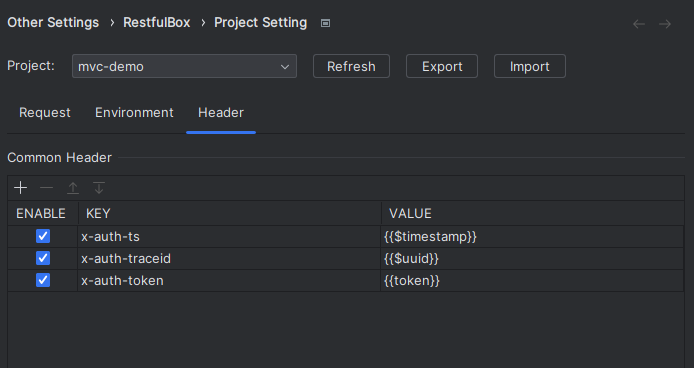

# 环境变量

## 概述

- 环境变量表示提前配置的一组或多组变量，包括 `字面量变量`、`直接引用变量`、`内置函数变量` 和 `脚本变量`。
- 可用于URL、Config、Headers、Params、Body和请求脚本等。
- 通过占位符方式来引用环境变量。
- 每个项目的配置独立（Project级别），支持导入导出。


## 操作路径

- Preferences(Settings) > Other Settings > RestfulBox > Environment
- RestfulBox tool window > toolbar > setting > Environment Setting

## 添加

1. 点击 `Add`，输入唯一的环境变量组名。建议使用简短名称，如 `DEV`、`FAT`、`UAT`、`PRE`、`PRO`。
2. 在当前组下的列表中增加/删除/移动变量键值对，可勾选是否启用。
3. 默认会创建 `baseUrl: http://localhost:8080`，适用于HTTP协议接口，用于替换**Config Tab**中的 `{{baseUrl}}`。
4. **VALUE**为字符串，可使用内置函数变量和脚本变量，参见下文说明。



## 复制

从当前环境变量复制一份新的环境变量。点击 `Copy`，输入唯一的环境变量组名，命名不能重复。

## 重命名

重命名选中的环境变量

## 删除

删除当前环境变量组及内容，点击 `Delete`。

## 导出&导入

1. 点击`Export`将本页配置中的环境变量、环境脚本、全局请求头以JSON格式复制到剪切板。
2. 在需要导入环境变量的项目中打开配置页面，点击`Import`。导入的环境变量会替换当前已配置的所有内容。
3. 若导出导入过程中出现异常，请参考`Event Log`中的提示。

## KEY-VALUE规则

**KEY、VALUE**均为字符串，其中VALUE支持引用变量，支持如下：

- 直接引用变量：引用当前环境变量中已存在的键值对，使用方式：`{{KEY}}`
- 内置函数变量：默认提供了内置函数，使用方式：`{{$functionName}}` 
   - `{{$timestamp}}` 当前时间戳，单位：毫秒(ms)
   - `{{$timestamp/3}}` 当前时间戳，单位：秒(s)
   - `{{$uuid}}` 生成UUID，36位，格式：xxxxxxxx-xxxx-xxxx-xxxx-xxxxxxxxxxxx
   - `{{$uuid-}}` 生成UUID，32位，无分隔符 -
- 脚本变量：点击`Script Variable`，在弹出框中编辑脚本变量。目前只支持Java语言，编写规则参考注释，无第三方库支持。使用方式：`{{$methodName$}}`

```java
public class RestKitScript {

    /**
     * Your script method, no param, method name must from {{$methodName$}}.
     * Use pre-request script can be more powerful.
     *
     * @return return value should be String
     */
    public static String methodName() {
        return "";
    }

}
```

## 全局请求头

配置选定项目中发送请求时默认附带的请求头。


